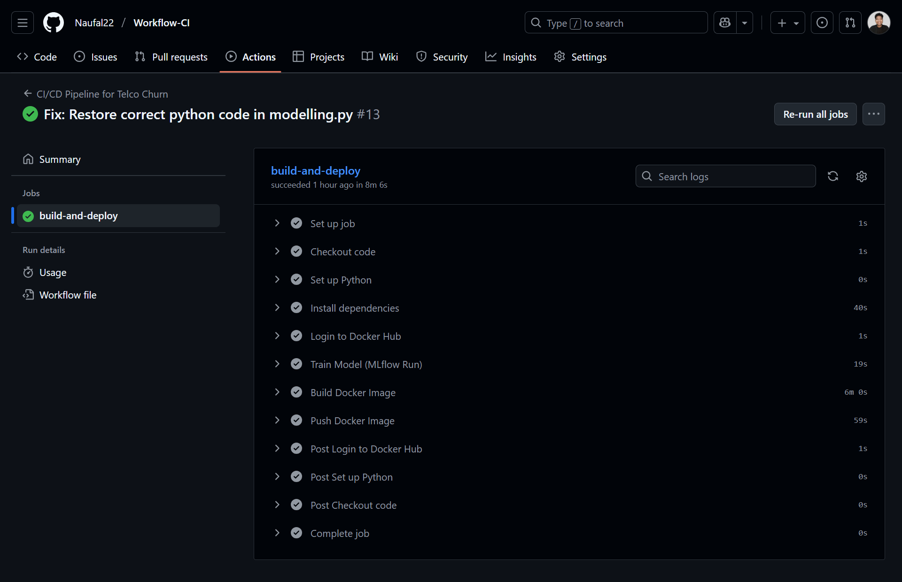
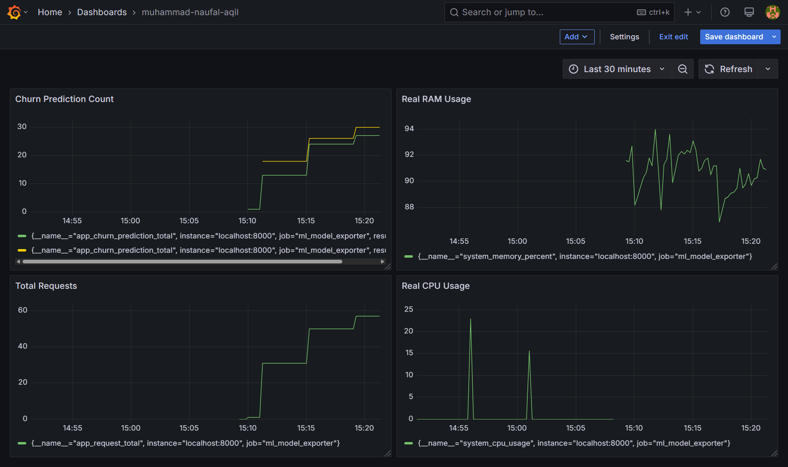

# Pipeline MLOps: CI/CD & Sistem Monitoring (Telco Churn)

## 👤 Penulis
**Muhammad Naufal Aqil**
*Dicoding Submission: Membangun Sistem Machine Learning (MLOps)*

## 📖 Ringkasan Proyek
Repositori ini berisi **Pipeline Produksi (CI/CD)** dan **Sistem Monitoring** untuk model prediksi churn. Repositori ini fokus pada otomatisasi pengiriman model dari kode hingga menjadi aplikasi kontainer, serta pemantauan kesehatan sistem secara real-time.

## ⚙️ Arsitektur & Teknologi
- **CI/CD**: GitHub Actions
- **Containerization**: Docker & Docker Hub
- **Model Registry**: MLflow Project
- **Monitoring**: Prometheus (Pengumpul Metrik) & Grafana (Visualisasi)
- **Serving**: Flask API

## 🔄 Alur Kerja Pipeline CI/CD
Setiap kali ada *push* ke branch `main`, workflow otomatis akan berjalan:
1.  **Setup Environment**: Menginstall dependensi Python.
2.  **Training Model**: Melatih ulang model menggunakan data terbaru.
3.  **Build Docker Image**: Membungkus model dan kode inferensi menjadi Docker Container.
4.  **Push ke Docker Hub**: Mengupload image ke registry kontainer publik secara otomatis.

## 📊 Sistem Monitoring Full-Stack
Sistem ini dirancang untuk memantau kesehatan model di lingkungan produksi menggunakan kombinasi Prometheus dan Grafana.

### Kemampuan Dashboard Grafana
Dashboard memvisualisasikan metrik penting untuk tim Engineering dan Bisnis:
- 👥 **Active Users** (Trafik pengguna real-time)
- 📉 **Model Accuracy** (Simulasi performa model)
- 🖥️ **System Resources** (Penggunaan CPU & Memory Server)
- 📡 **Request Throughput** (Total permintaan API yang masuk)

## 🖼️ Tangkapan Layar (Screenshots)

### 1. Pipeline CI/CD (GitHub Actions)

### 2. Dashboard Monitoring Real-time (Grafana)

---
*Proyek ini mendemonstrasikan implementasi siklus hidup MLOps, mulai dari eksperimen hingga deployment dan monitoring produksi.*